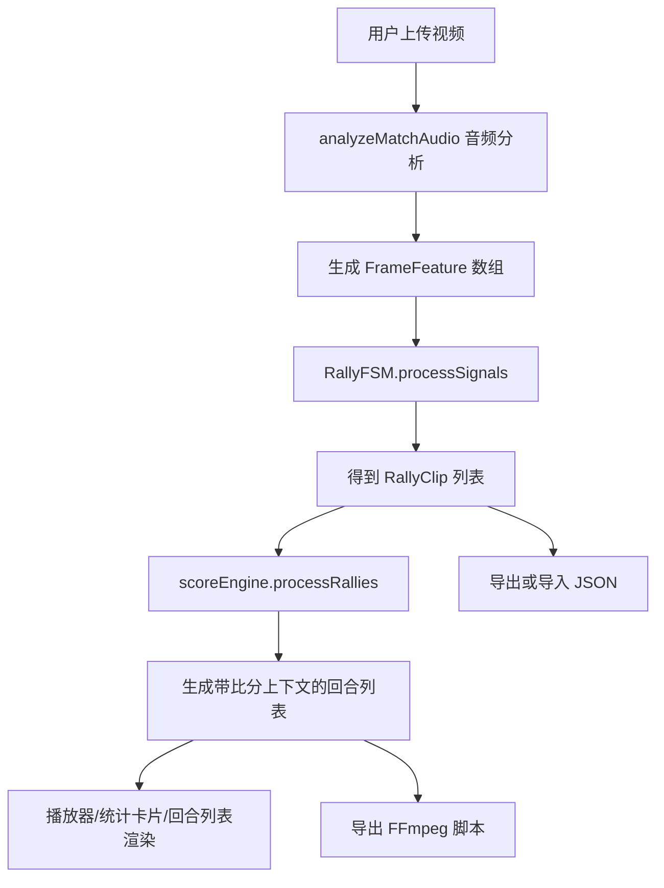

## MatchClip-AI 项目代码分析总结

### 1. 项目定位

这是一个基于 `React + TypeScript + Vite` 的**羽毛球比赛智能剪辑前端原型项目**。项目的目标是：

- 上传比赛视频
- 基于音频信号分析击球时刻
- 通过有限状态机识别回合片段
- 根据发球方/胜方推演比分
- 在播放器、统计面板和回合列表中展示结果
- 支持导出 JSON 项目数据、FFmpeg 剪辑脚本，以及演示版视频导出

从代码实现看，它更像一个**高保真 MVP / 原型系统**，UI 已经较完整，但底层算法和导出链路仍带有明显的演示性质。

---

### 2. 技术栈与运行方式

### 前端技术栈

- `React 19`
- `TypeScript`
- `Vite`
- `lucide-react`：图标
- `recharts`：信号图表
- `Tailwind CSS CDN`：页面样式

### 运行入口

- 页面入口：`index.html`
- React 挂载入口：`index.tsx`
- 主应用：`App.tsx`

### 运行特征

项目没有后端服务，当前核心分析逻辑全部运行在浏览器端：

- 音频解析使用 `Web Audio API`
- 回合识别使用本地有限状态机
- 计分和导出脚本生成都在前端完成

---

### 3. 目录结构与职责

```text
MatchClip-AI/
├── App.tsx                    # 主页面与绝大多数业务状态管理
├── index.tsx                  # React 启动入口
├── index.html                 # HTML 模板
├── types.ts                   # 核心类型定义
├── components/
│   ├── SmartPlayer.tsx        # 智能播放器
│   └── SignalChart.tsx        # 信号图表
├── services/
│   ├── mockDataService.ts     # 音频分析与兜底 mock 数据
│   ├── fsmService.ts          # 回合识别状态机
│   ├── scoreService.ts        # 羽毛球计分引擎
│   └── ffmpegService.ts       # FFmpeg 脚本生成
├── package.json               # 依赖与脚本
├── vite.config.ts             # Vite 配置
├── tsconfig.json              # TS 配置
└── metadata.json              # 项目元信息
```

---

### 4. 核心数据模型

项目的数据设计整体比较清晰，主要围绕以下几个类型展开：

### `FrameFeature`

表示逐帧分析结果，关键字段包括：

- `t`：时间戳（秒）
- `motion_score`：运动强度
- `hit_audio`：是否检测到击球音
- `hit_visual`：是否检测到视觉击球
- `shuttle_held`：是否检测到持球准备发球
- `shuttle_ground`：是否检测到球落地

这说明项目设计目标并不只是“纯音频分析”，而是预留了**音频 + 视觉联合判断**的接口。

### `RallyClip`

表示一个回合片段：

- `start` / `end`：回合起止时间
- `hits`：回合拍数
- `serverSide`：本回合发球方（A=近方，B=远方）
- `winner`：胜方（可显式给定，也可由后续逻辑推导）

### `ScoreState`

表示某一时刻的比分状态：

- `scoreA` / `scoreB`
- `server`
- `serviceSide`
- `visualServiceCourt`
- `isGamePoint`
- `isInterval`

### `RallyClipWithState`

在原始回合基础上附加：

- `scoreStateBefore`
- `scoreStateAfter`

这个设计很实用，因为 UI 展示、视频导出、回合列表、关键分筛选都依赖它。

---

### 5. 业务主流程

整体业务流程如下：



### 关键流程说明

#### 5.1 视频上传

`App.tsx` 中通过 `handleFileUpload`：

- 缓存用户选择的文件
- 生成本地 `videoUrl`
- 重置历史分析结果

#### 5.2 音频分析

`startAnalysis` 会调用 `analyzeMatchAudio(file)`：

- 读取视频文件为 `ArrayBuffer`
- 通过 `AudioContext.decodeAudioData` 解码音轨
- 按固定采样窗口分析音量峰值与 RMS
- 生成 `FrameFeature[]`

#### 5.3 回合识别

`RallyFSM` 根据帧级信号识别回合：

- `IDLE`：空闲状态
- `SERVE_PREP`：检测到持球准备发球
- `RALLY`：正式回合中
- `END_PENDING`：等待确认回合结束

#### 5.4 比分推导

`scoreEngine.processRallies(rallies)` 为每个回合计算：

- 回合前比分
- 回合后比分
- 发球方与站位信息
- 是否关键分

#### 5.5 结果展示

结果会同时驱动：

- `SmartPlayer`：播放器叠加比分和智能跳转
- `SignalChart`：信号图和回合高亮
- 比赛数据卡片：统计汇总
- 回合列表：筛选、排序、手工修正、选中导出

---

### 6. 主要模块分析

### `App.tsx`

这是项目的**绝对核心文件**，承担了：

- 页面状态管理
- 文件上传
- 分析流程控制
- 比分统计汇总
- 回合排序与筛选
- 当前回合自动滚动
- 手工修正（发球方、胜方、拍数、拆分、合并、删除）
- 导入/导出 JSON
- 导出 FFmpeg 脚本
- 导出演示视频

### 优点

- 功能集中，业务主线清楚
- `useMemo` 用于区分“比分处理”和“列表展示”，思路正确
- `dataVersion` 强制刷新机制能解决导入后局部 UI 不刷新的问题
- 编辑模式和普通模式区分明确

### 问题

- 文件过大，约 900 行，已经同时承担了**容器组件 + 业务编排 + 视图渲染 + 编辑逻辑**四类职责
- 后续维护成本会迅速升高
- 很多操作彼此耦合，测试难度大

### 建议拆分

建议至少拆成以下层次：

- `hooks/useMatchAnalysis.ts`
- `hooks/useRallyEditor.ts`
- `components/StatsPanel.tsx`
- `components/RallyList.tsx`
- `components/ExportActions.tsx`

---

### `components/SmartPlayer.tsx`

这是一个体验做得比较好的模块，功能包括：

- 播放/暂停
- 空格键控制
- 智能模式 `Smart` 与原始模式 `Raw` 切换
- 根据当前时间显示比分和发球站位
- 回合结束后显示 `GAME OVER`
- 在非回合区间自动跳到下一回合开始位置

### 亮点

- `ralliesWithState` 预先计算，播放器只消费结果
- 智能跳过死球时间的逻辑符合“剪辑播放器”的产品定位
- 叠加比分 UI 与当前回合标签配合得比较好

### 注意点

播放器显示的比分依赖 `scoreEngine` 结果，因此底层计分一旦不准，播放器显示也会整体偏移。

---

### `components/SignalChart.tsx`

主要职责：

- 展示 `motion_score`
- 标出音频击球点
- 标出 `shuttle_held` / `shuttle_ground`
- 用 `ReferenceArea` 高亮检测出的回合区间
- 点击图表定位视频时间

### 特点

- 已考虑大数据量下采样：`data.filter((_, i) => i % 5 === 0)`
- 同时支持“连续信号”和“离散事件”的可视化
- 适合作为人工核验工具

### 局限

当前视觉信号实际上大多没有真实来源，图表展示能力强于真实检测能力。

---

### `services/mockDataService.ts`

虽然文件名还是 `mockDataService`，但其中 `analyzeMatchAudio` 已经承担了真实音频分析职责。

### 当前实现方式

- 只分析音频，不分析画面
- 用音频峰值估算击球点
- 用随机/启发式方式模拟 `motion_score`
- `hit_visual`、`shuttle_held`、`shuttle_ground` 在真实分析路径中基本都为 `false`
- 解码失败时回退到 `generateMockSignalData`

### 评价

这是一个**“真实音频分析 + 模拟视觉信号”的折中实现**，适合原型验证，不适合直接称为完整 AI 识别系统。

---

### `services/fsmService.ts`

该文件实现了项目的回合检测核心：有限状态机 `RallyFSM`。

### 识别思路

- 通过音频/视觉命中信号判断回合开始
- 通过持球、落地、超时等条件判断回合结束
- 对音频击球做简单去抖处理
- 最终输出 `RallyClip[]`

### 设计优点

- 状态切换语义清晰
- 对“准备发球”“死球结束”做了专门建模
- 有首段热身时间跳过机制，减少误检

### 明显问题

#### 1. 胜方是随机生成的

`finalizeRally` 中存在：

- `const simulatedWinner = Math.random() > 0.5 ? 'A' : 'B';`

这意味着 FSM 产出的 `winner` 是随机值，而不是从真实信号推导出来的。

#### 2. 发球方也依赖上一个随机胜方

`serverSide` 被设置为上一个 `lastWinner`，因此整个比赛的发球流转会受随机值影响。

#### 3. `MIN_HITS_IF_VISUAL_CONFIRMED` 没有真正生效

代码中定义了视觉确认下的较低回合门槛，但在 `END_PENDING` 中：

```ts
const minHits = this.currentRallyStart !== null ? this.MIN_HITS_FOR_RALLY : this.MIN_HITS_FOR_RALLY;
```

无论条件是否成立，实际取值都一样，说明这段逻辑没有实现完。

#### 4. `SERVE_PREP` 的超时逻辑基本无效

`SERVE_PREP` 分支里用到了 `lastHitTime`，但进入该状态时并没有同步一个可靠的时间基准，因此这个超时判断难以真正发挥作用。

### 结论

FSM 的结构是对的，但当前版本仍然是**原型算法**，还没有达到稳定、可复现实战结果的程度。

---

### `services/scoreService.ts`

这是羽毛球计分引擎，设计意图是：

- 优先使用显式 `winner`
- 否则根据“下一回合发球方是否延续”来反推本回合胜者

### 优点

- 把“比分推导”和“界面展示”分离得较好
- 支持 `scoreStateBefore` / `scoreStateAfter`
- 对近方/远方与左右发球区做了可视化转换
- `processRallies` 输出结构非常适合 UI 消费

### 关键问题

这个模块本身设计没有太大问题，但它与 `fsmService.ts` 之间存在**语义冲突**：

- 计分引擎希望 `winner` 是“手工修正值或外部可信值”
- 但 FSM 默认给每个回合都写入了随机 `winner`
- 于是计分引擎会优先相信随机值，而不是按下一回合发球方推导

这会导致：

- 比分结果具备随机性
- 同一个视频多次分析可能出现不同比分逻辑
- “根据发球方推演比分”的设计目标被破坏

### 建议

如果要保留当前设计，应修改为：

- FSM 输出时**不要默认写入 `winner`**
- 仅在人工编辑或导入 JSON 时才写入显式 `winner`

---

### `services/ffmpegService.ts`

主要职责：

- 根据回合列表拼接 FFmpeg `filter_complex`
- 为每个回合裁剪音视频片段
- 叠加比分、回合编号、发球信息字幕
- 最终拼接成一个精华视频处理脚本

### 优点

- 支持传入 `RallyClipWithState`，因此导出可以保留完整比分上下文
- 字幕内容设计比较贴合业务
- 对 FFmpeg 文本转义有基本处理

### 注意点

当前真正“导出成视频”的按钮并没有调用 FFmpeg，而只是下载原视频 URL 作为演示结果。也就是说：

- `导出 FFmpeg 脚本`：相对真实
- `导出视频`：当前是演示行为，不是实际剪辑产物

---

### 7. 当前产品能力总结

从代码实现看，项目已经具备以下完整体验闭环：

- 上传视频
- 分析回合
- 显示比分与统计
- 回放与智能跳转
- 人工修正回合结果
- 保存/导入项目 JSON
- 导出后处理脚本

这说明项目在**交互闭环**上已经比较完整。

但在**识别准确性**与**导出真实性**两个方面，仍停留在原型阶段。

---

### 8. 代码中的关键风险与不一致点

### 8.1 随机赢家导致比分不可信

这是当前最核心的问题。

影响范围：

- 统计比分
- 播放器比分显示
- 关键分识别
- 导出脚本字幕
- JSON 保存后的复现一致性

### 8.2 “真实 AI”与“演示逻辑”混用

代码中同时存在：

- 真实音频解析
- 模拟运动分数
- 模拟视觉信号
- 演示版视频导出

这会让项目对外能力描述和实际能力之间存在落差。

### 8.3 `App.tsx` 过于庞大

长文件会带来：

- 修改某个功能容易影响别处
- 组件复用困难
- 单元测试不易落地
- 状态耦合度高

### 8.4 配置与实际代码存在脱节

#### README / Vite 中提到了 `GEMINI_API_KEY`

但当前仓库代码中没有看到真正调用 Gemini 的业务主线。

#### `index.html` 引用了 `/index.css`

但仓库中未发现对应文件，存在资源引用不完整的问题。

#### `index.html` 同时包含 import map 与 Vite 本地依赖

这说明项目有从在线原型迁移到本地工程的痕迹，配置层面仍可进一步收敛。

### 8.5 命名层面存在历史残留

例如：

- `mockDataService.ts` 已不只是 mock
- 一些文案仍强调 AI，但部分逻辑实际上是启发式规则

---

### 9. 优点总结

尽管存在原型痕迹，这个项目仍有不少值得肯定的点：

- **产品感强**：UI、播放器、回合列表、导出操作都比较完整
- **数据结构清晰**：类型定义比较合理
- **展示链路顺畅**：分析结果到 UI 的映射关系明确
- **编辑能力实用**：支持修正发球方、胜者、拆分、合并、删除
- **可扩展性不错**：已为视觉检测和更强规则引擎预留接口
- **可解释性较好**：`SignalChart` 和比分状态适合人工复核

---

### 10. 推荐的优化优先级

如果要继续迭代，建议按以下顺序处理：

### P0：修复结果可信度

1. 去掉 `fsmService.ts` 中的随机 `winner`
2. 明确 `winner` 只用于“人工覆盖”或“导入结果”
3. 让 `scoreEngine` 主要依据真实发球序列推导比分

### P1：把原型逻辑和真实逻辑分层

1. 将真实音频分析与 mock 数据彻底拆开
2. 重命名 `mockDataService.ts`
3. 明确哪些信号是真实检测，哪些只是占位字段

### P2：拆分 `App.tsx`

1. 拆分视图区域
2. 提炼业务 hooks
3. 把导入导出、编辑逻辑、统计逻辑拆到独立模块

### P3：补齐真实导出链路

1. 明确浏览器端导出视频是否可行
2. 如果不可行，可切到后端 FFmpeg 或本地命令执行方案
3. 保证“导出视频”与“导出脚本”行为一致

### P4：补测试与配置清理

1. 为计分引擎补单元测试
2. 为 FSM 补输入输出样例测试
3. 清理无用环境变量、占位文案和历史配置
4. 修复缺失的 `index.css` 引用

---

### 11. 最终结论

这是一个**完成度较高的前端原型项目**，核心价值不在于“算法已经成熟”，而在于它已经把以下事情打通了：

- 回合分析的产品交互
- 比分展示和回放体验
- 人工修正与结果导出
- 后续算法替换的接口结构

如果把它当成一个“可演示、可继续工程化”的羽毛球智能剪辑前端基础盘，这个项目是合格的。

如果把它当成“当前就可以稳定自动计分和自动剪辑的生产级系统”，那么还差至少三步：

- 去掉随机逻辑
- 增强真实检测能力
- 补齐真实导出闭环

---

### 12. 一句话总结

**当前仓库最像一个具备完整产品外形的智能剪辑原型：界面和交互已经很完整，但底层回合识别、计分可信度和导出落地能力仍需要继续工程化。**
